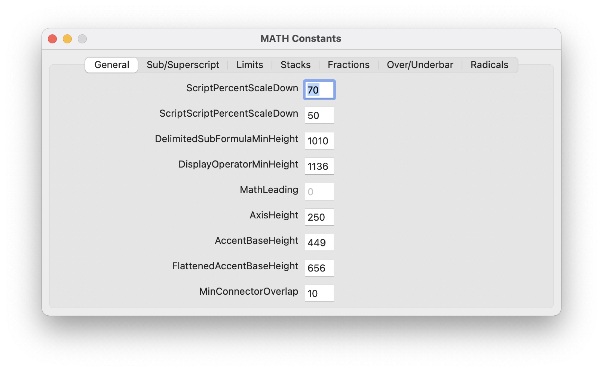

Glyphs OpenType MATH Plug-in
============================

This is a plug-in for [Glyphs app](https://glyphsapp.com) to edit OpenType MATH
table data as well as generate MATH table when exporting font.

Installation
------------

To install from Git, clone this repository, open `MATHPlugin.glyphsPlugin` in
Glyphs (e.g. by double clicking or drag and drop), and Glyphs will prompt you
to install it. Select Install, and when asked whether to Copy or Alias the
plug-in, Alias is preferred so that the plug-in gets updated when the local
clone is updated without having to install again.

The plug-in requires FontTools and Vanilla modules, make sure to install them
from _Window → Plugin Manger → Modules_.

Restart Glyphs and the plug-in should be ready (when the plug-in is updated
Glyphs should be restarted as well, to use the new version).

Usage
-----

The plug-in adds some new menu entries:
* _Edit → Edit MATH Constants..._ for editing font-level MATH table constants.
  The constants are saved per-master and should be edited for each master.
  
* _Glyph → Edit MATH Variants..._ for editing glyph-level MATH variants,
  assembly, and extended shape flag.
  The values are saved per-master and should be edited for each master.
  
* _View → Show MATH Italic Correction_ draws a vertical _blue_ line if there is
  an anchor named `math.ic`.
  This anchor will be used to generate italic correction. Only the _x_-position
  is effective, the _y_-position is ignored.
* _View → Show MATH Top Accent Position_ draws a vertical _magenta_ line if
  there is an anchor named `math.ta`.
  This anchor will be used to generate top accent position. Only the
  _x_-position is effective, the _y_-position is ignored.
* _View → Show MATH Cut-ins_ draws _green_ lines if there anchors starting with
  the names `math.tr` (top right), `math.tl` (top left), `math.br` (bottom
  right), `math.bl` (bottom left). There can be more than one anchor starting
  with each prefix (e.g. `math.tr_1`, `math.tr_2`, etc) each describing one
  corner of the glyph.
  Both _x_ and _y_-position of the anchor are used to generate the math kerning
  info.
  

If the font contains any MATH data, the plug-in will generate MATH table when
the font is exported, no extra steps are needed.
