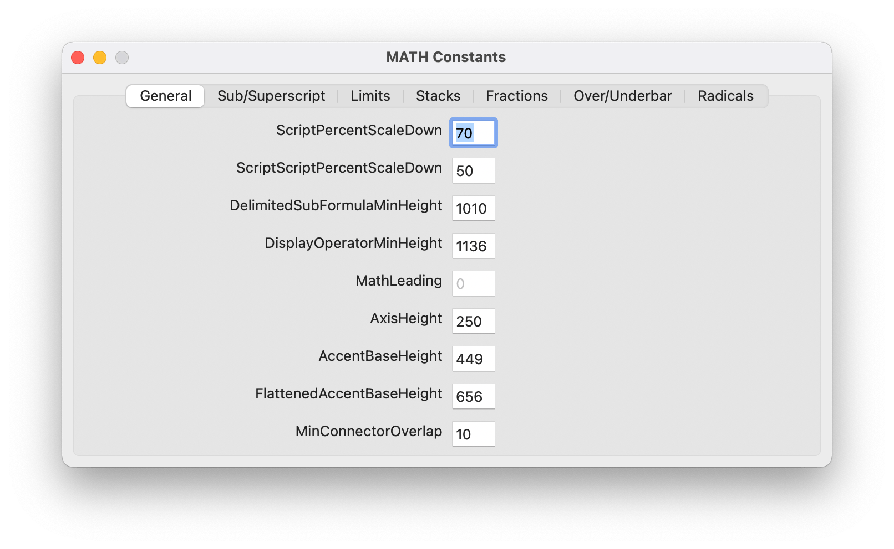
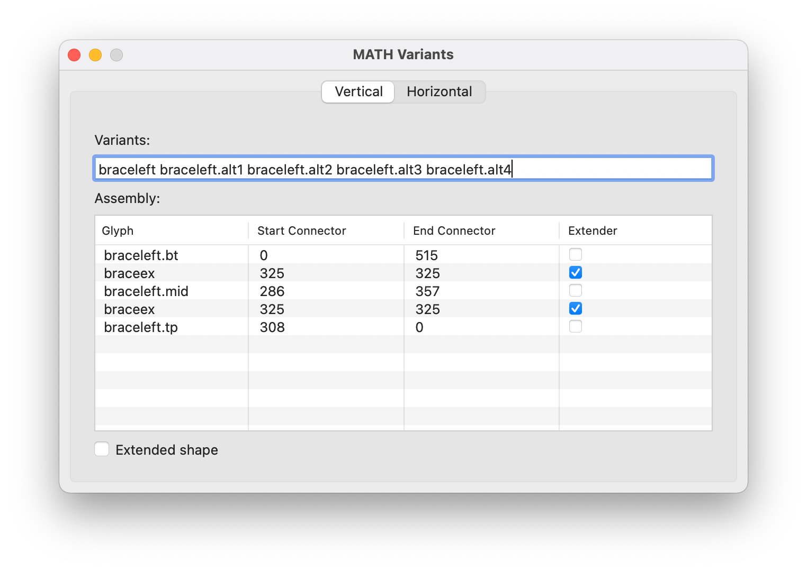

Glyphs OpenType MATH Plug-in
============================

This is a plug-in for [Glyphs app](https://glyphsapp.com) to edit OpenType MATH
table data as well as generate MATH table when exporting font.

Installation
------------

Go to _Window → Plugin Manger_ and search for “OpenType MATH Plug-in” and
install it.

Restart Glyphs and the plug-in should be ready (when the plug-in is updated,
Glyphs should be restarted as well to use the new version).

Usage
-----

Below is a quick reference for using the plug-in. For a more in depth
documentation about building math fonts using this plug-in, see the
[Building OpenType math fonts][1] article.

The plug-in adds some new menu entries:
* _Edit → Edit MATH Constants..._ for editing font-level MATH table constants.
  The constants are saved per-master and should be edited for each master.
  
* _Glyph → Edit MATH Variants..._ for editing glyph-level MATH variants,
  assembly, and extended shape flag.
  The assemblies are saved per-master and should be edited for each master, the
  rest is saved globally and should be the same for all masters.
  
* _View → Show MATH variants_ and _View → Show MATH Assembly_ draw math
  variants and extensible assemblies.
  
* _View → Show MATH Italic Correction_ draws a vertical _blue_ line if there is
  an anchor named `math.ic`.
  This anchor will be used to generate italic correction. Only the _x_-position
  is effective, the _y_-position is ignored.
* _View → Show MATH Top Accent Position_ draws a vertical _magenta_ line if
  there is an anchor named `math.ta`.
  This anchor will be used to generate top accent position. Only the
  _x_-position is effective, the _y_-position is ignored.
* _View → Show MATH Cut-ins_ draws _green_, _blue_, _cyan_, and _red_ lines if
  there are anchors starting with the names `math.tr` (top right), `math.tl`
  (top left), `math.br` (bottom right), `math.bl` (bottom left). There can be
  more than one anchor starting with each prefix (e.g. `math.tr.1`,
  `math.tr.2`, etc) each describing one corner of the glyph.
  Both _x_ and _y_-position of the anchor are used to generate the math kerning
  info.
  

If the font contains any MATH data, the plug-in will generate MATH table when
the font is exported, no extra steps are needed.

Advanced
--------

Sometimes it desired to disable `MATH` table generation. This can be done by
calling the following from Glyphs’s Macro Panel:
```python
Glyphs.defaults["com.nagwa.MATHPlugin.skipExport"] = True
```

[1]: https://github.com/notofonts/math/blob/main/documentation/building-math-fonts/index.md
